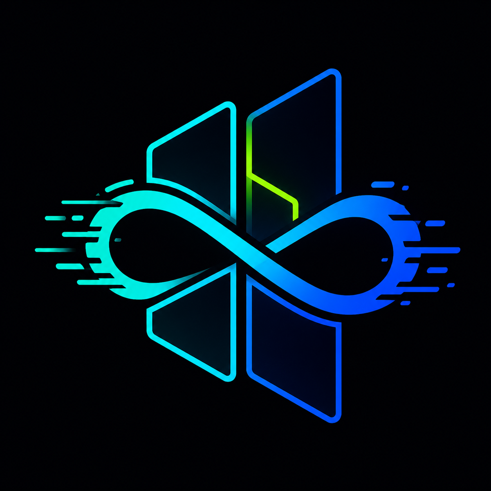

# Parallax Hypr Drift

<h1 align="center"></h1>

Parallax Hypr Drift is an experimental Wayland compositor fork built around one
main idea:

**take the practical tiling workflow people like in Hyprland, then place it on
an infinite canvas instead of hiding everything behind separate isolated
workspaces.**

The result is a desktop model where workspaces are not just invisible slots.
They are real zones on a larger spatial map. You can use them like normal
workspaces, move windows between them, zoom out to see the bigger layout, and
later project that layout into parallax or cube-style views.

This is not intended to be "plain DriftWM with a few extra bindings". The target
is a compositor that feels closer to Hyprland for daily use, while keeping the
infinite-canvas freedom that fixed workspace compositors do not have.

## Why This Matters

Most tiling compositors treat each workspace as a separate hidden screen. That
works, but it also means context disappears the moment you switch workspace.

Parallax Hypr Drift is exploring a different model:

- Workspaces exist together on one continuous canvas.
- The user can jump between zones instantly, like normal workspaces.
- The user can zoom out and understand the whole desktop spatially.
- Windows can move between zones without losing their relationship to the
  larger map.
- Future parallax views can turn the same workspace map into a 3D-feeling
  desktop surface.

The benefit is not just visual. It gives the desktop a memory. Instead of
thinking "which workspace did I hide that on?", the user can build a physical
layout: code here, browser there, terminal cluster below, media or monitoring
behind/above/aside.

## Design Direction

Parallax Hypr Drift is being shaped around these principles:

- **Tiling is the foundation.** Normal windows should tile automatically inside
  their workspace zone.
- **Floating is intentional.** Floating is an escape hatch for special windows,
  not the default behavior.
- **Cursor position matters.** New windows should appear where the user is
  working and split the tile under the cursor, matching the feel of Hyprland's
  practical placement.
- **Workspaces are visible regions.** Six workspace zones live on the same
  infinite canvas instead of being fully hidden from one another.
- **The camera is part of the desktop.** Moving between workspaces is camera
  movement across a larger surface, not a hard switch into an unrelated screen.
- **Parallax should be projection, not reassignment.** Future 3D/cube/parallax
  modes should change how the same workspace map is viewed, not shuffle window
  ownership.
- **Config should become programmable.** TOML is useful today, but the long-term
  goal is a Hyprland-like programmable config layer, likely Lua, for richer user
  control.

## Current Features

Current development focus:

- Six workspace zones on one infinite canvas.
- `SUPER+1` through `SUPER+6` jumps the camera to a workspace zone.
- `SUPER+SHIFT+1` through `SUPER+SHIFT+6` moves the hovered/focused window to a
  zone and retiles it there.
- Hyprland-inspired tiled placement inside each workspace zone.
- New tiled windows spawn into the target workspace instead of appearing in an
  arbitrary canvas location first.
- New windows can split the tile under the cursor.
- `SUPER+V` toggles a window between floating and tiled.
- `SUPER+T` forces all normal windows in the current workspace back into tiling.
- Closing, floating, or moving a tiled window should make remaining windows fill
  the available space again.
- XWayland support is being integrated directly so X11 apps can participate more
  cleanly in the compositor.
- Diagnostics are intentionally verbose while hard-freeze and placement bugs are
  being found.

This is still experimental. It is useful for rapid compositor research and local
testing, but it is not yet presented as a stable daily-driver release.

## Workspace Model

The compositor currently uses six stable workspace IDs.

Default flat grid:

```text
1  2  3
4  5  6
```

Each workspace is a real rectangle on the infinite canvas. Windows in workspace
1 tile inside workspace 1's rectangle. Windows in workspace 5 tile inside
workspace 5's rectangle. The camera jumps between these areas, but the larger
canvas still exists.

Future parallax/cube interpretation:

```text
        4
1       2       3
        5
        6
```

In that mode, the same six workspace IDs can be viewed like a cube-net:

- `2` is front/center.
- `1` is left.
- `3` is right.
- `4` is above.
- `5` is below.
- `6` is behind.

The important part is that workspace identity remains stable. A parallax mode
should change the view, not destroy or reorder the user's windows.

## Key Bindings

`Mod` means `SUPER` in the public config.

| Binding | Action |
| --- | --- |
| `Mod+1` .. `Mod+6` | Jump camera to workspace zone |
| `Mod+Shift+1` .. `Mod+Shift+6` | Move hovered/focused window to zone and retile |
| `Mod+A` | Toggle between workspace 1 and previous canvas position |
| `Mod+O` | Toggle between six-workspace overview and previous canvas position |
| `Mod+Ctrl+M` | Toggle independent/mirrored monitor viewports |
| `Alt+1` .. `Alt+0` | Move cursor/focus to monitor 1..10 by layout order |
| `Mod+V` | Toggle focused window floating/tiled |
| `Mod+T` | Force current workspace back into tiling |
| `Mod+W` | Zoom to fit current windows |
| `Mod+Q` / `Mod+Return` | Launch terminal in the example config |
| `Mod+C` | Close focused window in the example config |
| `Print` / `Mod+P` | Full screenshot in the example config |
| `Shift+Print` / `Mod+Shift+P` | Area screenshot in the example config |

Public example config:

```text
parallax-hypr-drift/config.toml
```

## Multi-Monitor Canvas

External monitors look at the same infinite canvas. By default each physical
monitor has its own viewport, so if the pointer is on monitor 1 then `Mod+2`
moves only monitor 1 to workspace 2; if the pointer is on monitor 2 then
`Mod+4` moves only monitor 2 to workspace 4.

Monitor placement follows the configured output layout, similar to Hyprland's
monitor positions. Use `[[outputs]] position = [x, y]` to decide how the pointer
crosses between screens. `Mod+Ctrl+M` toggles mirror mode, where all connected
monitors follow the active monitor's camera and zoom. `Alt+1` through `Alt+0`
warps the cursor to a monitor by layout order, so a user can switch active
monitors without dragging across the whole output arrangement.

## What Makes It Different

### Compared With Traditional Tiling

Traditional tiling is efficient, but each workspace is isolated. Parallax Hypr
Drift keeps the efficiency of tiling while giving the user a larger spatial
surface.

### Compared With Floating Infinite Canvas

An infinite canvas is powerful, but pure floating placement becomes messy.
Parallax Hypr Drift adds a structured tiling layer so the canvas stays usable
for real work.

### Compared With Hyprland

Hyprland already has strong tiling, focus, animation, and app behavior. The
piece this project adds is the infinite-canvas workspace model: visible zones,
camera movement, zoom, and future parallax projection.

### Compared With Upstream DriftWM

DriftWM provides the infinite-canvas base. Parallax Hypr Drift changes the
workflow direction toward mandatory workspace tiling, Hyprland-like placement,
six stable workspace zones, XWayland hardening, stronger session startup, and a
future programmable config path.

## Configuration Today

The compositor is still TOML-compatible with the upstream base.

Important current reality:

- The public project name is `parallax-hypr-drift`.
- The Rust package and built binary are still currently named `driftwm`.
- A staged rename plan exists because changing the crate, binary, session,
  config, IPC, and portal names in one pass would break too much.

Current upstream-compatible default config path:

```text
~/.config/driftwm/config.toml
```

Public Parallax Hypr Drift example config path:

```text
~/.config/parallax-hypr-drift/config.toml
```

For now, prefer passing the config explicitly:

```bash
./target/release/driftwm --config ~/.config/parallax-hypr-drift/config.toml
```

Useful fork-specific options:

```toml
workspace_layout = "grid"
window_placement = "tile"
focus_follows_mouse = true
```

## Lua Configuration Direction

The long-term configuration goal is more ambitious than TOML.

TOML is fine for static settings, but this project wants Hyprland-style
programmability:

- richer startup logic
- reusable keybinding helpers
- workspace layout functions
- parallax mode toggles
- theme logic
- animation profiles
- future per-workspace behavior

Target direction:

```lua
drift.mod_key("super")
drift.workspace_layout("grid")
drift.window_placement("tile")
drift.focus_follows_mouse(true)

drift.bind("mod+q", "spawn kitty")
drift.bind("mod+c", "close-window")
drift.bind("mod+v", "toggle-floating")
drift.bind("mod+t", "tile-current-workspace")

drift.command("parallax-mode", function()
  drift.workspace_layout("cube-net")
  drift.parallax.enable_cube_projection()
end)

drift.bind("mod+p", "lua parallax-mode")
```

Lua should request behavior. Rust should remain authoritative for Wayland
safety, compositor state, tiling validity, focus, grabs, and protocol rules.

## Roadmap

### Stage 1: Workspace Zones

Status: in progress.

- Six stable workspace IDs.
- Camera jumps with `SUPER+1..6`.
- Move windows with `SUPER+SHIFT+1..6`.
- Flat grid now, cube-net projection later.

### Stage 2: Hyprland-Style Tiling

Status: in progress.

- Tiled windows fill the workspace zone.
- New windows split the tile under the cursor.
- Floating and close/unmap transitions retile remaining windows.
- `SUPER+T` forces current workspace windows back into tiling.

### Stage 3: App Launch And XWayland Reliability

Status: in progress.

- Improve DBus, Wayland, XDG, DISPLAY, and portal environment export.
- Make launched apps work without first opening another compositor.
- Integrate XWayland behavior so X11 apps can be managed predictably.

### Stage 4: Project Rename

Status: planned carefully.

The public name is `parallax-hypr-drift`, but some internals still say
`driftwm`. This is intentional until compatibility paths are ready.

Rename investigation:

```text
docs/project-rename-investigation.md
```

### Stage 5: Lua Config

Status: planned.

- Keep TOML compatibility.
- Add optional Lua config.
- Move user orchestration out of hard-coded Rust where safe.

### Stage 6: Parallax Projection

Status: planned.

- Keep workspace IDs stable.
- Add parallax/cube view of the same workspace map.
- Build animation and depth effects around the existing infinite canvas.

### Stage 7: Visual Polish

Status: planned.

- Animated borders.
- Better focused-window effects.
- Cleaner workspace outlines.
- More intentional shader/background presets.
- A stronger project visual identity and logo.

## Diagnostics

Temporary freeze diagnostics are documented here:

```text
docs/freeze-diagnostics.md
```

Default local freeze log:

```text
/home/unknown/Documents/scripts/projectcampaign/parallax-hypr-drift-freeze.log
```

The log is file-based and flushed line-by-line because hard freezes can prevent
normal journal inspection.

## Build

Requires Rust 1.88+.

Arch dependencies:

```bash
sudo pacman -S libdisplay-info libinput seatd mesa libxkbcommon
```

Build:

```bash
git clone https://github.com/mcqueentrading/parallax-hypr-drift.git
cd parallax-hypr-drift
cargo build --release
```

Run directly:

```bash
./target/release/driftwm --config parallax-hypr-drift/config.toml
```

Public launcher example:

```bash
parallax-hypr-drift/start-parallax-hypr-drift
```

Development checks:

```bash
cargo fmt
cargo check
```

## Useful Runtime Tools

- `xdg-desktop-portal` and `xdg-desktop-portal-wlr` for portals/screencast.
- `grim`, `slurp`, and `wl-clipboard` for screenshots.
- `kitty`, `foot`, or another Wayland terminal.
- `fuzzel`, `wofi`, or another launcher.
- XWayland support for apps that still require X11 behavior.

## Upstream Credit

Parallax Hypr Drift is based on DriftWM by malbiruk:

```text
https://github.com/malbiruk/driftwm
```

It also deliberately takes desktop workflow inspiration from Hyprland by Vaxry:

```text
https://github.com/hyprwm/Hyprland
https://hypr.land
```

The parallax direction is also inspired by `neorx_`, whose work helped shape
the idea of treating the desktop as a depth-aware canvas rather than only a
flat workspace switcher.

DriftWM provides the infinite-canvas Wayland compositor foundation. This fork
changes the product direction toward Hyprland-style tiling, focus behavior,
window placement, monitor ergonomics, and programmable configuration, while
keeping DriftWM's infinite-canvas foundation. Credit belongs to both projects:
DriftWM for the editable infinite-canvas base, and Hyprland/Vaxry for the
proven tiling workflow we are using as the reference target. `neorx_` deserves
credit for helping shape the parallax/depth inspiration.

## License

GPL-3.0-or-later
